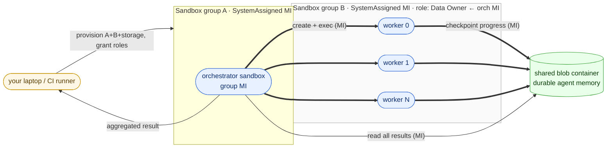

# 03 — Shared blob memory (swarm with durable agent scratchpad)

Same MI-inception shape as
[`01-mi-inception`](../01-mi-inception/) — an orchestrator sandbox in
Group A uses its managed identity to spawn N worker sandboxes in
Group B — **with one addition**: an Azure Blob container that every
sandbox in the swarm reads and writes through its managed identity.
That container is the swarm's shared, durable memory.



## What this demonstrates to customers

1. **Durable agent state, with no secrets in agent code.** Each worker
   talks to Azure Blob Storage through its sandbox group's managed
   identity. A worker that dies leaves its checkpoint behind in the
   container — the next run (or a sibling) can pick up where it left
   off. There is no connection string, no SAS token, no service
   account JSON anywhere in any agent's code or environment.
2. **A real shared memory between agents.** All workers read and
   write the same blob container, so one agent's findings are
   immediately visible to the others — the classic "shared
   scratchpad" pattern used by multi-agent systems, but backed by
   Azure-managed durable storage instead of in-process memory.
3. **Blast radius is bounded by RBAC.** The orchestrator group's MI
   gets `Container Apps SandboxGroup Data Owner` on the worker group
   only, and `Storage Blob Data Contributor` on a single container.
   Workers can only touch that one container; they cannot spawn more
   sandboxes, cannot reach any other storage, and cannot escalate.
4. **Survives interruption.** Kill a worker mid-flight and its last
   checkpoint is still durably stored in the container. Real swarms
   in production restart workers from that checkpoint instead of
   recomputing from scratch.

## Demo task

Same Monte Carlo Pi as variant 01, but each worker writes its
result as a small JSON blob to the shared container:

```
shared-memory/{run_id}/worker-{i}.json     # one blob per worker
  {
    "worker": 0,
    "sandbox_id": "...",
    "inside": 786412,
    "total": 1000000,
    "checkpoints": [200000, 400000, 600000, 800000, 1000000]
  }
```

The orchestrator never reads stdout from the workers — it learns the
state of the swarm purely by listing and reading blobs. Identical
contract to a real multi-agent system where workers report progress
into a shared store.

## Run

After the [baseline setup](../../../setup) has written `samples/.env`:

```bash
# Python SDK variant — end-to-end validated
cd python
pip install -r requirements.txt
python swarm.py
```

The script provisions, on each run:

- One throwaway orchestrator sandbox group (SystemAssigned MI).
- One throwaway worker sandbox group (SystemAssigned MI).
- One throwaway storage account + one container `shared-memory`.

…and tears all three down on exit. Total wall-clock is dominated by
storage-account provisioning (~30s) and group provisioning (~1–2
minutes total).

## What you'll see

```
==> Provisioning orchestrator group 'swarmblob-orch-<id>' (SystemAssigned MI)...
==> Provisioning worker group 'swarmblob-workers-<id>' (SystemAssigned MI)...
==> Provisioning storage account 'swarmblob<id>'...
==> Granting 'Container Apps SandboxGroup Data Owner' on worker group → orch MI...
==> Granting 'Storage Blob Data Contributor' on container → both group MIs...
==> Waiting for RBAC propagation...
==> Creating orchestrator sandbox...
==> Installing SDK + uploading spawn_workers.py into orchestrator...
==> Orchestrator: spawning 4 workers in worker group via MI...
    worker 0: 5 checkpoints, 786,412 / 1,000,000 inside
    worker 1: 5 checkpoints, 785,127 / 1,000,000 inside
    worker 2: 5 checkpoints, 786,503 / 1,000,000 inside
    worker 3: 5 checkpoints, 784,981 / 1,000,000 inside
==> Reading 4 result blobs from shared container...
==> Aggregating across 4,000,000 darts...
    π ≈ 3.142412  (error 8.2e-04)
==> Done.
```

## How "shared state" appears in the script

The orchestrator and workers all auth to blob with the same one-liner:

```python
from azure.identity.aio import ManagedIdentityCredential
from azure.storage.blob.aio import BlobServiceClient

cred = ManagedIdentityCredential()
blob = BlobServiceClient(f"https://{account}.blob.core.windows.net", cred)
```

No SAS, no connection string, no account key. Each worker writes:

```python
container = blob.get_container_client("shared-memory")
await container.upload_blob(
    f"{run_id}/worker-{i}.json",
    json.dumps(state).encode(),
    overwrite=True,
)
```

The orchestrator reads everything back at the end:

```python
async for b in container.list_blobs(name_starts_with=f"{run_id}/"):
    payload = json.loads(await (await container.download_blob(b.name)).readall())
```

## Production tips

- **Use private endpoints on the storage account.** Once the basic
  pattern is in place, lock down public network access to the
  storage account and add a private endpoint in the sandbox group's
  egress VNet. Workers reach the container without traversing the
  public internet.
- **Container-level RBAC, not account-level.** The grant in this
  scenario is scoped to one container, not the storage account.
  Workers that compromise their MI token still can't touch other
  containers in the same account.
- **Use blob leases or `if-none-match` for coordination.** When
  workers race to claim the same work-item from the blob queue, a
  lease (or conditional `PUT` with `If-None-Match: *`) gives you a
  cheap, durable mutex with no extra service to run.
- **Set a lifecycle rule on the container.** Per-run blob trees
  (`{run_id}/...`) make cleanup simple — a 7-day delete rule on the
  container prevents costs from drifting up across thousands of
  swarm runs.

## Files

- [`python/swarm.py`](python/swarm.py) — host orchestration + the
  embedded inner script that runs inside the orchestrator sandbox.
- [`python/requirements.txt`](python/requirements.txt) — inherits
  the shared `azure-identity` + sandbox SDK, adds
  `azure-mgmt-storage` and `azure-storage-blob`.
