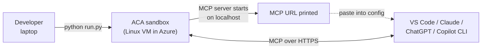

# 08-mcp-hosting — MCP servers in sandboxes

A sandbox is a perfect host for a **Model Context Protocol (MCP)** server:
the MCP server is process-local to whatever it serves (a tool runtime, a
headless browser, a database, …), the sandbox provides isolation + a
public address, and your AI tool (VS Code Copilot Chat, Claude Desktop,
ChatGPT, this Copilot CLI) connects to it over HTTP.

This scenario collects two complementary patterns. They differ on the
**exposure mechanism** and on **what's behind the MCP** — together they
cover the two shapes most readers will need.

| Pattern | MCP server | Exposure | What it's for |
|---|---|---|---|
| [excalidraw-anonymous](excalidraw-anonymous/) | [`excalidraw-mcp`](https://github.com/excalidraw/excalidraw-mcp) on `:80` | sandbox `add_port(80, anonymous=True)` → public `*.proxy.azuredevcompute.io/mcp` | The simplest possible "host an MCP server in Azure" demo. Public URL, no auth, hand-drawn diagrams render inline in chat. |
| [dab-sql-devtunnel](dab-sql-devtunnel/) | [Data API Builder](https://learn.microsoft.com/azure/data-api-builder/mcp/overview) MCP server in front of PostgreSQL (Chinook sample DB) | [Microsoft Dev Tunnels](https://learn.microsoft.com/azure/developer/dev-tunnels/) — outbound only, **no inbound port on the sandbox** | The classic "give an agent typed access to a database" pattern. Auto-generated MCP tools per entity, RBAC enforced by DAB, zero SQL written by anyone. |

## Common interaction shape

Both patterns end the same way:

1. The script prints an **MCP URL** and a ready-to-paste config snippet.
2. You drop that URL into the MCP client of your choice.
3. You chat with your AI normally — the sandbox is invisible to you,
   new capabilities just appear.

The script's automated verification also performs a real MCP `initialize`
handshake against the URL before declaring success, so you know the
server is reachable before you bother opening another tool.

## Verify it works (three tiers)

The patterns are built to be verifiable at three levels of fidelity, so
you can stop at whichever matches where you're working:

1. **The script itself** — does an MCP `initialize` over HTTPS and asserts
   on the `protocolVersion` + `serverInfo` shape. If `run.py` exits 0,
   the endpoint is real.
2. **This Copilot CLI session** — once the URL is printed, ask:
   *"Register the MCP server at &lt;URL&gt; and list its tools"* — Copilot
   CLI supports MCP via its config and the tools become callable from
   this terminal, no IDE switch.
3. **VS Code / Claude / ChatGPT** — each pattern's README has a
   copy-pasteable config snippet for the major clients.

## Pick a pattern

- **Start with `excalidraw-anonymous`** if you just want to see "an MCP
  server in a sandbox" work end-to-end. Five-minute path from `az login`
  to drawing diagrams in chat. No DB, no .NET, no tunnel.
- **Use `dab-sql-devtunnel`** when you want the realistic
  "MCP-in-front-of-data" pattern, with no inbound port exposed on the
  sandbox. Heavier (Postgres + .NET + DAB + Dev Tunnels orchestration)
  but matches how you'd actually want to expose a private database to
  an agent.

## Status

| Pattern | Python SDK | `aca` CLI |
|---|---|---|
| `excalidraw-anonymous` | ✅ ready | 📝 planned |
| `dab-sql-devtunnel` | ✅ ready | 📝 planned |

## Composes with these guides

01 (sandboxes) · 06 (ports) · 08 (egress) · 02 (snapshots) · 03 (disks) · 05 (lifecycle) · 11 (labels)
