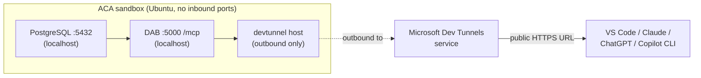

# dab-sql-devtunnel — DB → MCP, no inbound port on the sandbox

Run **PostgreSQL + the Chinook sample database + the Data API Builder
(DAB) SQL MCP Server** all inside one sandbox, and expose the MCP
endpoint to the public internet via **Microsoft Dev Tunnels** — so the
sandbox never opens an inbound port.

> Part of [scenarios/08-mcp-hosting](../README.md). See the sibling
> pattern [`excalidraw-anonymous`](../excalidraw-anonymous/) for the
> simpler "just `add_port`" exposure model.

## Why this pattern

This is the classic AI-app shape: **an agent that needs typed,
RBAC-controlled access to a database** without anyone writing SQL or
glue code.

- [Data API Builder](https://learn.microsoft.com/azure/data-api-builder/)
  auto-generates one MCP tool per entity from your DB schema —
  `Customer_list`, `Invoice_get`, `Track_filter`, etc. — each with
  typed parameters DAB derives from the column types.
- DAB enforces RBAC per role per entity. The agent literally cannot
  call operations the config doesn't grant.
- DAB deliberately **does not** do NL2SQL. The agent's tools are
  deterministic and auditable.

And by using Dev Tunnels for exposure:

- The sandbox has **zero inbound ports open** (the script verifies this
  with `aca sandbox port list`).
- Postgres + DAB both bind to `localhost` only — they're unreachable
  from anywhere except via the tunnel.
- Dev Tunnels handles HTTPS termination and a stable public URL.

## What it does



The script:

1. Creates a sandbox on the `ubuntu` disk (`2 CPU / 4 GiB`).
2. Installs and starts PostgreSQL; creates a `dab` user + `chinook`
   database.
3. Downloads the [Chinook PostgreSQL script](https://github.com/lerocha/chinook-database)
   and loads it (artists, albums, tracks, customers, invoices — ~15
   tables, ~80 KB seed).
4. Installs the .NET 8 SDK via the official `dotnet-install.sh`.
5. Installs DAB as a global .NET tool (`dotnet tool install -g
   Microsoft.DataApiBuilder`), version-pinned.
6. Uploads [`dab-config.json`](app/dab-config.json) — points DAB at
   local Postgres, enables MCP, sets `authentication.provider:
   "Unauthenticated"`, grants the `anonymous` role `read` on each
   entity, and disables MCP write tools globally.
7. Starts `dab start` on port `5000` as a background process; verifies
   MCP `initialize` on `http://localhost:5000/mcp`.
8. Installs the `devtunnel` CLI.
9. **Pauses for a one-time interactive login** — prints the device-code
   instructions and waits for you to complete sign-in in a browser. The
   token is cached inside the sandbox for the rest of the run.
   (See "About Dev Tunnels login" below.)
10. Runs `devtunnel host -p 5000 --allow-anonymous` in the background,
    parses the public URL from its stdout, and verifies the public MCP
    `initialize` handshake from the host side.
11. Confirms the sandbox has no inbound ports (`list_ports()` is empty)
    and prints the result as proof.
12. Prints copy-pasteable config snippets for the major MCP clients.

## Run it

```bash
cd python
pip install -r requirements.txt
python run.py
```

## What you can do with it

Once the URL is in your MCP client, ask your AI in normal chat:

- *"Who are the top 5 customers by total invoice amount?"*
- *"What's the average track length per genre? Show as a table."*
- *"Which albums by AC/DC are in the catalog?"*
- *"How many invoices were issued in Brazil last year?"*

The agent calls the typed DAB tools (`Customer_list`, `Invoice_list`,
`Track_filter`, …), aggregates results, answers in natural language.
**No SQL is written by anyone** — schema, types, filters, and
permissions all flow from `dab-config.json`.

Writes (`Customer_create`, `Invoice_update`, …) are intentionally
disabled in this demo via `runtime.mcp.dml-tools` + `anonymous: [read]`
permissions. To allow writes, edit `dab-config.json` and restart `dab`.

## About Dev Tunnels login

`devtunnel host` requires the host process to be authenticated, even
when `--allow-anonymous` lets consumers connect without auth. There's
no browser inside the sandbox, so the script triggers the
device-code flow:

```
==> ACTION REQUIRED: open https://microsoft.com/devicelogin
    and enter code: ABCD-EFGH
    Waiting for login to complete...
```

Sign in with any Microsoft or GitHub account. The token is cached
inside the sandbox at `~/.devtunnels/` for the rest of the run; tearing
down the sandbox discards it.

## Verify it works

The script already proves the MCP endpoint is up by running an
`initialize` handshake over HTTPS. To chat with it for real, pick one:

### From this Copilot CLI session

After the URL is printed, ask me:

> "Register the MCP server at `<URL>` as `chinook`, list its tools,
> then ask: 'who are the top 5 customers by spend?'"

I'll add it to the CLI's MCP config and we'll run the query together.

### From VS Code Copilot Chat

Add to `.vscode/mcp.json`:

```json
{
  "servers": {
    "chinook": {
      "type": "http",
      "url": "https://<tunnel-id>-5000.<region>.devtunnels.ms/mcp"
    }
  }
}
```

### From Claude Desktop / ChatGPT

Settings → Connectors → Add custom connector → paste the URL.

### Inspect the tool catalog

```bash
npx -y @modelcontextprotocol/inspector <URL>
```

Opens a browser UI listing every tool DAB generated, with full input
schemas — great for confirming permissions landed the way you
configured them.

## Production tips

- **For production, use Azure Relay Hybrid Connections instead of Dev
  Tunnels.** Dev Tunnels is purpose-built for ephemeral dev/test
  workflows. For a durable production deployment with the same
  outbound-only exposure property, install the
  [Hybrid Connection Manager](https://learn.microsoft.com/azure/app-service/app-service-hybrid-connections)
  in the sandbox, point it at `localhost:5000`, and have consumers
  reach it through the Relay namespace.
- **Don't expose write tools anonymously.** This demo is read-only on
  purpose. If you allow writes, gate the tunnel on Entra (`devtunnel
  host ... --allow-tenant <tenant>`) and grant a non-anonymous DAB role
  through DAB's authentication providers
  ([docs](https://learn.microsoft.com/azure/data-api-builder/authentication)).
- **Bake the disk.** [Guide 03 (disks)](../../../guides/03-disks/README.md)
  — pre-install Postgres + .NET + DAB + devtunnel onto a custom disk so
  cold start is "boot the DB" instead of "install everything."
- **Snapshot with seed data.** [Guide 02 (snapshots)](../../../guides/02-snapshots/README.md)
  — snapshot after Chinook is loaded; each restored sandbox starts with
  a fresh, identical DB in ~1s.
- **Lock down egress.** [Guide 08 (egress)](../../../guides/08-egress/README.md)
  — set `set_egress_default("Deny")` and allow only the hosts the
  pattern needs:

  | Host | Why |
  |---|---|
  | `*.devtunnels.ms` | Dev Tunnels relay traffic |
  | `global.rel.tunnels.api.visualstudio.com` | Dev Tunnels control plane |
  | `login.microsoftonline.com` | Device-code login + token refresh |
  | `aka.ms`, `*.azureedge.net` | Dev Tunnels installer |
  | `packages.microsoft.com`, `dot.net` | .NET install |
  | `*.nuget.org` | DAB tool install |
  | `raw.githubusercontent.com` | Chinook SQL download (one-time) |

  …plus your own DB's outbound needs if any.
- **Bring your own DB.** Replace the Chinook seed with your schema and
  edit the entities block in `dab-config.json`. Restart `dab start`
  inside the sandbox to pick up the new config. Same outcome, your
  data, your RBAC.

## Layout

```
dab-sql-devtunnel/
├── README.md                  ← this file
├── app/
│   └── dab-config.json        ← uploaded into the sandbox
└── python/
    ├── README.md
    ├── requirements.txt
    └── run.py
```
