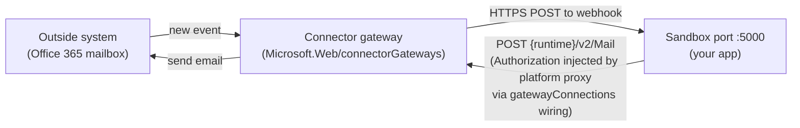
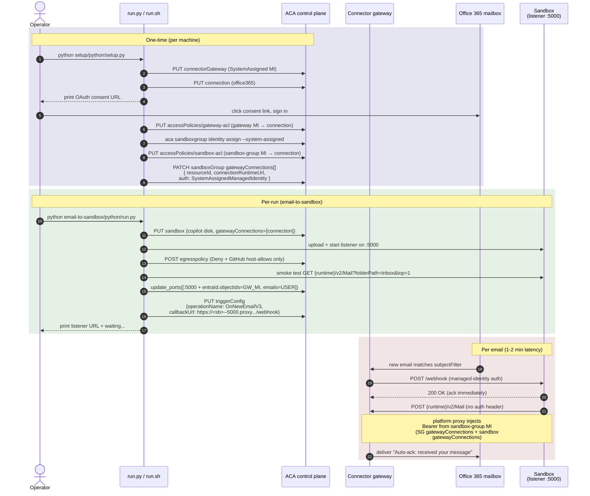

# 10-connectors-triggers — Push outside events into a sandbox

> **AI apps on Azure PaaS + serverless** — sandboxes pillar.

An [Azure Container Apps sandbox](https://learn.microsoft.com/azure/container-apps/sandbox)
is a great place to run an event-driven workload: a small HTTP server
listens on a sandbox port, and an outside system pushes events to it
over HTTPS. **Connector gateways** make that outside system into one of
the hundreds of pre-built Power Platform connectors — Office 365,
SharePoint, OneDrive, Outlook, Teams, Dataverse, third-party SaaS, your
own on-prem APIs — without you writing any polling code.

This scenario uses the **Office 365** connector with **OnNewEmailV3**
(inbound trigger) and **SendMailV2** (outbound action) as a worked
round-trip example, but the same shape applies to every trigger the
connector platform exposes.



## Quickstart with `azd up`

If you have the [Azure Developer CLI (`azd`)](https://learn.microsoft.com/azure/developer/azure-developer-cli/install-azd)
installed, this scenario also ships an `azd up` flow that wraps the two
manual setup steps below into a single command:

```bash
cd samples/sandboxes/scenarios/10-connectors-triggers
azd auth login          # if you haven't already
az login                # the postprovision hook also needs the az CLI
azd up
```

> [!IMPORTANT]
> **Pick a sandbox-supported region.** `Microsoft.App/sandboxGroups` is
> only available in a fixed set of regions (`westus2`, `eastus2`,
> `westus3`, `centralus`, `northeurope`, `uksouth`, …). The `azd up`
> template enforces this via `@allowed(...)` on `location` in
> `infra/main.bicep`, so picking an unsupported region (e.g. `eastus`)
> fails up front with a clear deployment error rather than partway
> through the postprovision hook. The default is `westus2`. To pick a
> different supported region:
>
> ```bash
> azd env set AZURE_LOCATION westus2
> azd up
> ```
>
> If you already provisioned into an unsupported region by accident,
> run `azd down --purge` first, then re-run `azd up`.

What `azd up` does:

1. `infra/main.bicep` creates **just the resource group** (everything
   else uses preview API versions that don't have Bicep types yet, so
   the template intentionally stays tiny).
2. The `postprovision` hook (`infra/hooks/postprovision.{sh,ps1}`) then
   delegates to the same imperative setup scripts documented below:
   - `samples/sandboxes/setup/python/setup.py` — sandbox group +
     SystemAssigned MI + `Container Apps SandboxGroup Data Owner` role.
   - `setup/python/setup.py` — connector gateway + MI, Office 365
     connection (walks the one-time OAuth consent), both access
     policies, and writes everything to `samples/.env`.
3. The hook then mirrors the resulting connector keys into the azd
   environment so `azd env get-values` shows the gateway, connection,
   and runtime URL.

Per-run sandbox / trigger lifecycle is intentionally **not** part of
`azd up` — sandboxes are ephemeral. After `azd up`, fire the demo with
the existing run script:

```bash
cd email-to-sandbox/python && pip install -r requirements.txt && python run.py
# or
bash email-to-sandbox/cli/run.sh
```

`azd down` deletes the resource group and everything inside it
(gateway, connection, ACLs, sandbox group). Re-run `azd up` after a
`down` to rebuild.

## Sub-scenarios

This folder contains a **shared setup** and **two sub-scenarios** that
build on it.

| Folder | What it shows | When to use |
|---|---|---|
| [`setup/`](setup) | Provisions a connector gateway + Office 365 connection + access policy, walks the one-time OAuth consent | Run **once** before either sub-scenario |
| [`trigger-lifecycle/`](trigger-lifecycle) | CRUD walk-through of the trigger config API against a tiny in-script HTTP listener (no real email needed) | Learn the API shape — discover ops, PUT / list / disable / enable / delete |
| [`email-to-sandbox/`](email-to-sandbox) | Round-trip: real Office 365 inbox → trigger → Python listener in a sandbox (`copilot` disk image) → reply composed by the GitHub Copilot CLI → SendMailV2 back through the **same** connection | See the full pattern wired to a real mailbox, including egress-injected auth for outbound calls |

Each sub-scenario ships in **two flavors**: Python (`python/`) and bash
(`cli/`). Pick whichever matches the tooling you'd write the rest of
the integration in.

## Why a connector gateway (vs. polling Graph yourself)?

- **No polling code in your sandbox.** The gateway watches the source
  and POSTs to your webhook only when something happens. Your sandbox
  sleeps until then.
- **One auth boundary, many connectors.** OAuth consent happens once
  per (user × connection); every trigger on that connection reuses it.
  Adding a SharePoint trigger doesn't add another credential to manage.
- **Managed-identity auth to the sandbox port.** The gateway has a
  system-assigned MI; you add its principal to the sandbox port's
  `entraId.objectIds` and the gateway's POST is authenticated. No
  shared secret on the wire.

## Architecture



## Prerequisites

1. An Azure subscription with the **Azure Container Apps sandbox**
   feature enabled. (See repo root [setup guide](../../setup/).)
2. The shared sandbox baseline applied:
   `samples/sandboxes/setup/python/setup.py` **or**
   `samples/sandboxes/setup/cli/setup.sh`.
3. The connector-gateway baseline applied:
   `samples/sandboxes/scenarios/10-connectors-triggers/setup/python/setup.py`
   **or** the matching `cli/setup.sh`.
4. An Office 365 mailbox you can OAuth-consent into.
5. For Python: 3.10+. For CLI: bash on Linux, macOS, or Windows
   (Git Bash / WSL / MSYS2).

## Status

| Sub-scenario | Python | CLI |
|---|---|---|
| `setup` | ✅ ready | ✅ ready |
| `trigger-lifecycle` | ✅ ready | ✅ ready |
| `email-to-sandbox` | ✅ ready | ✅ ready |

## Composes with these guides

- [01-sandboxes](../../guides/01-sandboxes/README.md) — sandbox basics
- [06-ports](../../guides/06-ports/README.md) — `entraId.objectIds` for managed-identity callers
- [11-labels](../../guides/11-labels/README.md) — labels enable safe interrupted-run cleanup

## A note on the connector-gateway API

There's no Python SDK for `Microsoft.Web/connectorGateways` yet, so
both flows go through `az rest` against api-version
`2026-05-01-preview`. The samples wrap that call in a small helper
(`_az_rest()` in Python, `azreq()` in bash). When a typed SDK ships,
the wrappers shrink to one line and the rest of each script stays the
same.
