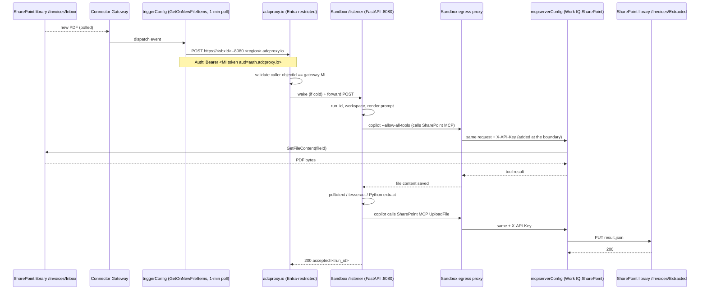

# 11 — Connectors + Sandboxes: SharePoint document automation

> **An Azure Connector Gateway trigger POSTs new SharePoint files
> directly to a Firecracker sandbox HTTP endpoint. Inside the
> sandbox, an LLM agent fetches the file via the SharePoint MCP,
> OCRs/extracts invoice data, and writes the result back to
> SharePoint. No receiver Container App, no Functions host — the
> sandbox _is_ the webhook target.**

This scenario showcases the **direct trigger → sandbox** pattern
that's unique to the Connector Gateway + ACA Sandbox preview:

- **Single connection** (SharePoint Online) used by both the trigger
  AND the sandbox's outbound MCP calls — clean round-trip without
  any external storage.
- **No glue infrastructure**: the gateway's trigger callback URL is
  the sandbox itself, fronted by the ACA Dev Compute proxy. Cold
  sandboxes wake on demand per event (`activationMode: OnDemand`).
- **OCR + LLM-driven extraction inside Firecracker isolation** — the
  agent decides whether to use `pdftotext`, `tesseract`, or fresh
  Python it writes on the spot to handle unusual invoice layouts.
  That kind of arbitrary-code-per-event execution can't safely live
  on a shared Function host.
- **Defense-in-depth egress**: deny-default + Transform rules at the
  sandbox boundary stamp the MCP API key and the GitHub Copilot
  authorization header. The sandbox itself holds **no credentials**.

## Architecture



## Security model

| Location                                  | Holds gateway API key? |
|-------------------------------------------|------------------------|
| Bicep state / azd deployment state        | ❌                     |
| Operator shell history                    | ❌                     |
| Connector Gateway control plane           | ✅ (issued)            |
| Sandbox env / disk / memory               | ❌                     |
| Sandbox egress proxy                      | ✅                     |
| Outbound MCP request on the wire          | ✅ (stamped by proxy)  |

The sandbox never sees the MCP key. Copilot CLI sees only the bare
gateway URL; the egress proxy stamps `X-API-Key` on every outbound
HTTPS request to the MCP host. Same defense-in-depth pattern as
scenario 10.

For the GitHub Copilot CLI auth, see the [scenario 10
README](../10-connectors-email-triage/README.md#key-design-decisions)
for the trade-off: Copilot CLI errors immediately if its env doesn't
contain a `COPILOT_GITHUB_TOKEN`, so the PAT has to live in the
sandbox env (proxy can't intervene before the network call). The
egress proxy stamps `Authorization` on the GitHub Copilot hosts as
defense-in-depth on top of that.

## What this ships

```
11-connectors-document-automation/
├── README.md                  this file
├── azure.yaml                 azd entrypoint (provision + post-deploy hook)
├── .gitignore
├── infra/
│   ├── main.bicep             root template
│   ├── main.parameters.json   azd parameter file
│   ├── modules/
│   │   ├── connector-gateway.bicep
│   │   ├── connection-sharepoint.bicep      sharepointonline (classic, for trigger)
│   │   ├── connection-sharepoint-mcp.bicep  workiqsharepoint (MCP backend)
│   │   ├── mcpserver-sharepoint.bicep       kind=ManagedMcpServer
│   │   ├── sandbox-group.bicep              Microsoft.App/sandboxGroups
│   │   └── gateway-sandbox-rbac.bicep       Gateway MI -> SandboxGroup Data Owner
│   └── scripts/
│       ├── postdeploy.py      orchestration (create sandbox, upload,
│       │                      bootstrap, register port, create trigger,
│       │                      OAuth consent)
│       ├── postdeploy.sh      Linux/macOS wrapper (venv + dispatch)
│       └── postdeploy.ps1     Windows wrapper (venv + dispatch)
├── host/                      everything that runs INSIDE the sandbox
│   ├── listener.py            FastAPI on :8080 — gateway trigger target
│   ├── prompt.md              template instructions for Copilot CLI
│   ├── requirements.txt
│   └── bootstrap.sh           one-time installer (apt + pip + systemd)
└── python/                    local-dev shortcut (run listener locally)
    ├── README.md
    └── samples/sample-file-properties.json
```

## How to run

```bash
cd samples/sandboxes/scenarios/11-connectors-document-automation

# Required env values (post-deploy bakes these into the sandbox)
azd env set GITHUB_PAT <ghp_...>
azd env set SHAREPOINT_SITE_URL 'https://contoso.sharepoint.com/teams/Finance'
azd env set SHAREPOINT_LIBRARY_ID '<library-guid>'         # GUID from SP REST API
azd env set SHAREPOINT_OUTPUT_FOLDER 'Extracted'           # default

# Optional: where to run the sandbox group (defaults to westus2)
azd env set ACA_SANDBOX_REGION westus2

azd up
```

Post-deploy will:
1. Resolve the SharePoint MCP runtime URL from the gateway.
2. Create (or reuse) the long-lived host sandbox.
3. Upload `host/listener.py` + `host/prompt.md` + `host/bootstrap.sh`.
4. Apply egress policy (deny + transforms).
5. Run `bootstrap.sh` inside the sandbox — installs the toolchain,
   starts uvicorn on :8080 under systemd.
6. Register port 8080 with the ADC proxy, with the gateway MI as the
   sole allowed Entra caller.
7. Create the trigger config — `callbackUrl` points at
   `https://<sbxId>--8080.<region>.adcproxy.io`.
8. Pop browser tabs for the two SharePoint connection consents.

After it finishes, drop an invoice PDF into your SharePoint
`/Invoices/Inbox` and within ~1 minute (the trigger poll cadence)
the sandbox will wake, fetch, OCR, extract, and upload the result
JSON to `/Invoices/Extracted`.

Tear down with `azd down --purge --force --no-prompt`.

## Going further: per-file child sandboxes

The shipped design uses **one long-lived host sandbox** that processes
files in series. The sandbox is isolated from any other tenant in the
sandbox group, but multiple files from the same SharePoint library
share the same Firecracker VM (in workspaces `/work/<run-id>/`).

For **true per-file isolation** — one Firecracker VM per invoice,
destroyed after — the host listener would spawn a child sandbox per
incoming trigger. That requires an Azure credential **inside** the
host sandbox (to call `Microsoft.App/sandboxGroups/.../begin_create_sandbox`).
Whether sandboxes expose IMDS / a managed identity in this preview
is not yet confirmed. When that lands, the change is roughly:

```python
async def _process_one(file_props, run_id):
    child = await sg_client.begin_create_sandbox(...).result()
    try:
        await _apply_egress(child)
        await child.write_file("/work/prompt.md", prompt)
        await child.exec("copilot --allow-all-tools -p $(cat /work/prompt.md)")
    finally:
        await child.delete()
```

The host sandbox becomes a tiny dispatcher; per-file workloads each
get their own kernel + their own deny-default egress. Drop-in
upgrade once the credential plumbing is figured out.

## Why a sandbox (and not a Function App)?

| Capability | Azure Functions | Sandbox |
|---|---|---|
| `apt install poppler-utils tesseract-ocr` per request | painful (custom container, slow cold start) | trivial |
| **Let the LLM write & execute fresh Python per document** | not possible (RCE against the Function host) | the whole point — Firecracker isolation |
| Parse a possibly-malicious PDF (CVE exposure) | shared host blast radius | one microVM dies, neighbors unaffected |
| Memory-hungry OCR on multi-page scans | tight consumption limits | per-VM CPU/RAM |
| Deny-default egress per invocation | no | yes — extracted data can ONLY go where we say |
| **Direct webhook target** (no glue compute) | needs the Function App itself as the receiver | the sandbox IS the webhook target |

## Related

- [Scenario 10 — connectors-email-triage](../10-connectors-email-triage/README.md)
  — same Connector Gateway + ACA Sandbox primitives, but with an
  ACA receiver in the middle and Teams MCP as the output sink. Read
  10 first for the security-model deep-dive; this one is the
  no-receiver evolution.
- [Microsoft Functions reference sample
  (functions-connectors-net-e2e-email-users-teams)](https://github.com/Azure-Samples/functions-connectors-net-e2e-email-users-teams)
  — comparable end-to-end flow built on Functions; useful to compare
  the dev experience.
